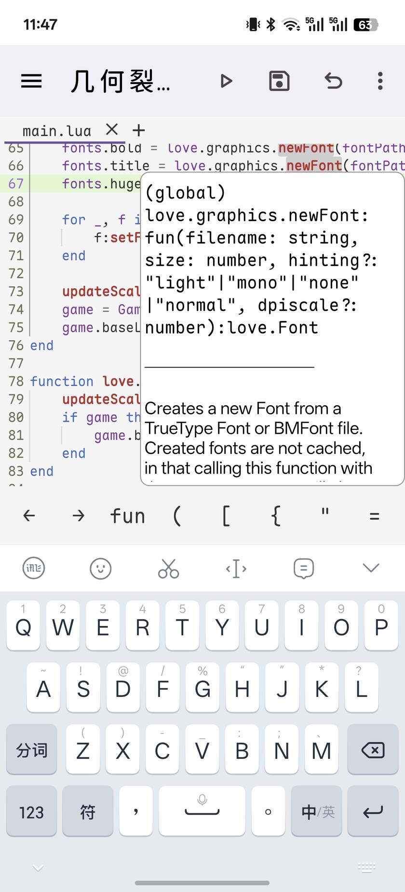
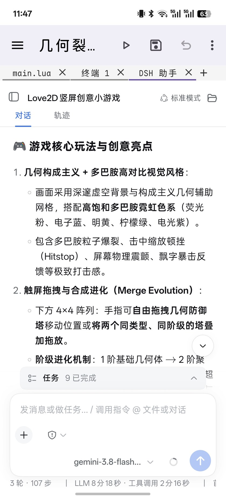
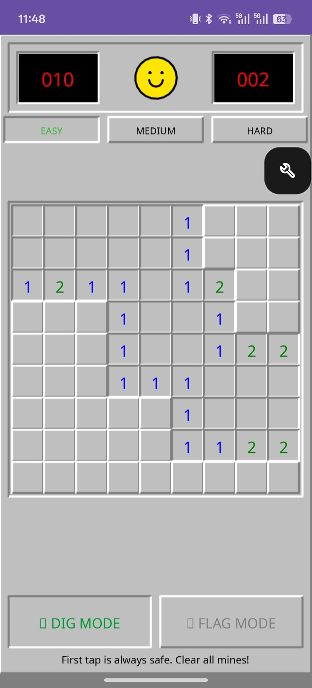
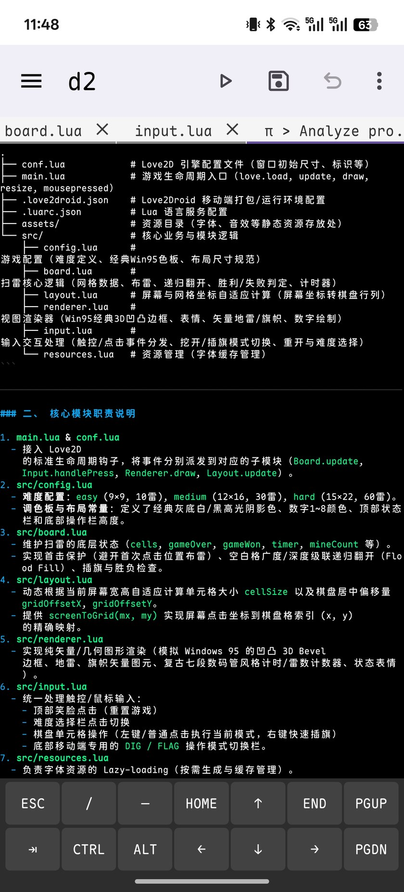
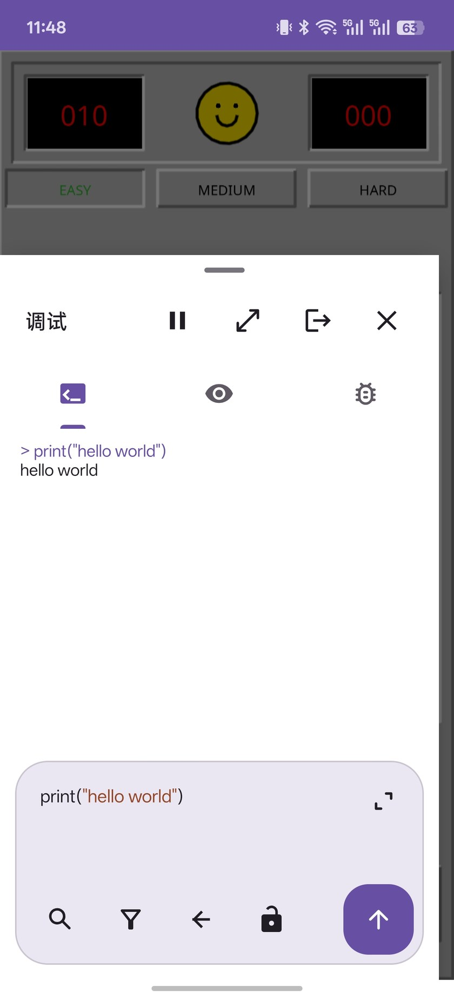

<div align="right">
  <strong>English · <a href="README_CN.md">简体中文</a></strong>
</div>

<p align="center">
  
</p>

<h1 align="center">Love2Droid</h1>

<p align="center">
  <strong>A pocket workspace for your next LÖVE game.</strong><br>
  Write Lua, run your game, and export an APK — right on Android™.
</p>

<p align="center">
  
  
  
  <a href="license.txt"></a>
</p>

<p align="center">
  <a href="https://github.com/wsdx233/Love2Droid/releases">Releases</a> ·
  <a href="#getting-started">Getting started</a> ·
  <a href="#build-from-source">Build from source</a> ·
  <a href="doc/README.md">Documentation</a> ·
  <a href="https://github.com/wsdx233/Love2Droid/issues">Report an issue</a>
</p>

---

## Screenshots

<p align="center">
  
  
  
</p>
<p align="center"><sub>Lua editing &amp; API help · Integrated AI workspace · On-device play</sub></p>

<details>
<summary><strong>More screenshots: terminal and debugging</strong></summary>
<br>
<p align="center">
  
  
</p>
<p align="center"><sub>Terminal &amp; Oh My Pi · In-game Lua console</sub></p>
</details>

## About

Love2Droid brings a LÖVE/SDL runtime, project manager, Sora-based editor, and optional Linux development tools into one Android app. It is built around a short loop: **create a project → write Lua → tap Play → export your game**. The editor and game run in separate processes.

This is an independent community project, not an official LÖVE or Google product. It is under active development; device-specific behavior and current limitations are tracked in [project status](doc/status.md).

## What you can do

<table>
  <tr>
    <td width="50%" valign="top">
      <h3>Edit with context</h3>
      <p>Multi-tab Sora Editor, TextMate highlighting, light/dark themes, project search, and session recovery. Optional LuaLS adds completion, hover documentation, definitions, and references.</p>
    </td>
    <td width="50%" valign="top">
      <h3>Run &amp; debug</h3>
      <p>Play saves project files and builds a <code>.love</code> snapshot for the bundled runtime. Inspect logs, evaluate Lua, watch expressions, and work with breakpoints in the in-game debug panel.</p>
    </td>
  </tr>
  <tr>
    <td width="50%" valign="top">
      <h3>Manage &amp; publish</h3>
      <p>Start from an empty or basic template. Organize project groups, browse files, import <code>.love</code>/<code>.zip</code>, and export <code>.love</code> or a signed game APK with your own name, icon, and package settings.</p>
    </td>
    <td width="50%" valign="top">
      <h3>Bring your tools</h3>
      <p>Install Ubuntu through PRoot on arm64 devices. Add Git, LuaLS, Oh My Pi, DeepSeek Harness, or headless LÖVE checks as needed. Use terminal tabs and an embedded DSH Web workspace without leaving the editor.</p>
    </td>
  </tr>
</table>

## Getting started

1. **Install Love2Droid.** Check [Releases](https://github.com/wsdx233/Love2Droid/releases) for published APKs, or [build one yourself](#build-from-source) if no package is available.
2. **Choose your tools.** The first-run setup can be skipped. Optional components can be installed later from **Settings → Environment & extension components**; downloading them requires a network connection.
3. **Create or import a project.** Choose the empty template for a minimal Hello World, or the basic template for a bundled Chinese-capable pixel font. Existing `.love` and `.zip` projects must contain `main.lua` at the archive root.
4. **Edit, then tap Play.** Save unnamed documents to project files first. Play saves writable tabs, validates `main.lua`, and runs a fresh snapshot.
5. **Export when ready.** Share a `.love` archive, or configure the project's name, package ID, version, orientation, permissions, and icon before building a game APK.

> **Keep backups.** Projects live in the app-specific external files directory, under `Android/data/top.wsdx233.love2droid/files/projects`. Uninstalling the app can remove them. Export important work before uninstalling or clearing app data.

## Requirements & boundaries

| Area | Current support |
| --- | --- |
| Android | Android 6.0 / API 23 or newer |
| Packaged native ABIs | `armeabi-v7a`, `arm64-v8a`, `x86_64` |
| PRoot & Linux tools | `arm64-v8a` only; installed on demand |
| Lua language services | Optional LuaLS; Android 6.0/7.x retain TextMate editing without Sora LSP |
| Game runtime | Bundled Android LÖVE 12.0 |
| Optional headless checks | Linux LÖVE 11.5 with Xvfb/Mesa; not a substitute for Android playtesting |
| AI assistants | Optional tools; model/provider credentials and connectivity depend on your configuration |

Only run projects, shell commands, and AI tools you trust. Games and development tools execute with the app's access to files; PRoot and `love-check` are **not security sandboxes**. Never share API keys or include them in exported projects. The standard build below produces a **debug APK**, not a production-signed release.

## Build from source

Use a Linux build environment with **JDK 17+**, **Android SDK Platform 37**, **NDK 27.3.13750724**, and **CMake 3.21 or newer**. Gradle uses the checked-in wrapper; native sources are included in this repository.

```sh
git clone https://github.com/wsdx233/Love2Droid.git
cd Love2Droid

# Point this at your installed Android SDK.
export ANDROID_HOME="$HOME/Android/Sdk"
CMAKE_BUILD_PARALLEL_LEVEL=2 ./gradlew :app:assembleNormalNoRecordDebug
```

Output:

```text
app/build/outputs/apk/normalNoRecord/debug/app-normal-noRecord-debug.apk
```

See [verification requirements](doc/verification.md) for focused logic tests, build requirements, and physical-device checks. Android UI, input methods, PRoot, and game-runtime behavior must be verified on real hardware; local build success does not establish device compatibility.

## Documentation

The detailed development notes are currently maintained in Chinese.

- [Documentation index](doc/README.md)
- [Architecture & module boundaries](doc/architecture.md)
- [Interface & editor behavior](doc/design.md)
- [Build & verification](doc/verification.md)
- [Implementation status & limitations](doc/status.md)
- [References & asset provenance](doc/reference.md)

Bug reports are welcome through [Issues](https://github.com/wsdx233/Love2Droid/issues). Include the app version, Android version, device/ABI, reproduction steps, and a minimal project or redacted logs where possible. Do not include credentials or private project files.

## Credits & licenses

Love2Droid builds on the work of the open-source community:

- **[LÖVE](https://love2d.org/) / [LÖVE Android](https://github.com/love2d/love-android) / [SDL](https://libsdl.org/)** — game runtime and Android integration.
- **[Sora Editor](https://github.com/Rosemoe/sora-editor) / [Lua Language Server](https://github.com/LuaLS/lua-language-server)** — code editing and Lua language intelligence.
- **[Termux](https://github.com/termux/termux-app) / [PRoot](https://github.com/termux/proot) / [r2droid](https://github.com/wsdx233/r2droid)** — terminal components and Linux environment integration references.
- **[Oh My Pi](https://github.com/can1357/oh-my-pi) / [DeepSeek Harness](https://github.com/deepseek-ai/deepseek-harness)** — optional AI development tools.
- **[Fusion Pixel Font](https://github.com/TakWolf/fusion-pixel-font)** — the basic project template's bundled pixel font.
- **[Material Symbols](https://fonts.google.com/icons) / [Devicon](https://github.com/devicons/devicon)** — interface symbols and the LÖVE vector used in the new app icon.
- **[Sts2MobileLauncher](https://github.com/ModinMobileSTS/Sts2MobileLauncher)** — README layout and presentation reference; no launcher code or game assets are reused here.

This repository includes components under different licenses. See [license.txt](license.txt), [licenses/](licenses/), and [reference notes](doc/reference.md); the upstream notices are not a blanket MIT license for the entire project.

The app icon adapts the Android robot into a hug around the LÖVE mark. **The Android robot is reproduced or modified from work created and shared by Google and used according to terms described in the [Creative Commons 3.0 Attribution License](https://creativecommons.org/licenses/by/3.0/).** Android is a trademark of Google LLC. LÖVE and other project names and marks belong to their respective owners; their use does not imply endorsement.
